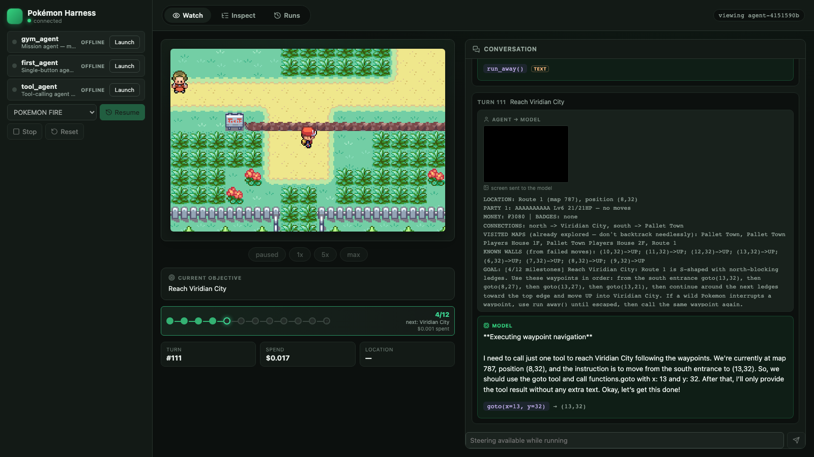

# Pokemon LLM Harness

A local harness for running LLM agents against Pokemon Red/Blue, with live gameplay, structured traces, save states, replay, and turn-by-turn observability.

Use it to watch what an agent saw, what it decided, which button it pressed, and how a run can be inspected or replayed afterwards.



## Features

- Live browser UI with gameplay on the left and agent/environment traces on the right.
- Turn-based trace cards for observations, decisions, actions, LLM calls, screenshots, and raw payloads.
- Save states and checkpoints for pausing, rewinding, branching, and replaying runs.
- Provider-neutral harness API: write an agent in Python or call the HTTP API from another language.
- Example LLM agent using an OpenAI-compatible provider.

## Requirements

- Python 3.12+
- [`uv`](https://docs.astral.sh/uv/)
- Node.js and npm
- RGBDS, used to build local Pokemon Red/Blue-compatible ROMs from source

The documented setup is expected to work on macOS, Linux, and WSL. Native Windows is not currently verified; WSL is the recommended Windows path.

## Setup

Install RGBDS:

```bash
# macOS
brew install rgbds
```

On Linux or WSL, install RGBDS through your package manager or from the RGBDS project instructions.

Run the project setup:

```bash
scripts/setup.sh
```

This installs Python/UI dependencies, builds local ROM-compatible binaries, starts a temporary backend, and creates the default bedroom save state.

## Launch

```bash
scripts/dev.sh
```

This starts the backend, UI, and all agents listed in `agents.yaml`. Open `http://localhost:5173`, select an agent from the harness dropdown, and click **Play**.

Agent stdout/stderr is written to `logs/<agent>.log`.

To add or remove agents, edit `agents.yaml`:

```yaml
agents:
  - name: my_agent
    module: harness.examples.my_agent
```

## Build Your Own Agent

Create a subclass of `PokemonAgent`, set a name, and implement `run()`:

```python
from harness import PokemonAgent

class FirstAgent(PokemonAgent):
    name = "First Agent"
    model = "qwen/qwen3.6-flash"

    def run(self) -> None:
        while not self.should_stop():
            state = self.state()

            self.emit("observation", {"pokemon": state["pokemon"]})
            self.emit("decision", {"action": "RIGHT", "reasoning": "Moving toward the exit."})
            self.press("RIGHT")

if __name__ == "__main__":
    FirstAgent().serve()
```

A fuller working template is in `harness/examples/first_agent.py`.

Inside `run()`, the main helpers are:

| Method | Description |
|---|---|
| `screenshot_bytes()` | Current game screen as PNG bytes |
| `screenshot(path)` | Save the current game screen to a file |
| `state()` | Current game state: map, position, party, screen hash |
| `press(button)` | Press A / B / UP / DOWN / LEFT / RIGHT / START / SELECT |
| `sequence(steps)` | Run button/wait steps as one atomic sequence |
| `save_state(name)` | Save a run-local checkpoint |
| `load_state(name)` | Load a run-local or shared checkpoint |
| `emit(type, payload)` | Add a structured event to the trace UI |
| `should_stop()` | Check whether the UI asked the agent to stop |

Override `serialize_history()` and `restore_history(data)` if your agent has message history, memory, or planning state that should rewind with a checkpoint.

Use `turn()` to group one logical agent step:

```python
with self.turn(goal="leave the bedroom"):
    state = self.state()
    self.emit("observation", {"pokemon": state["pokemon"]})
    self.emit("decision", {"action": "RIGHT", "reasoning": "Moving toward the exit."})
    self.press("RIGHT")
```

## LLM Providers

`harness.llm.LLMClient` wraps provider calls with retry/backoff and normalized response/error payloads. The example agent uses OpenRouter by default:

```python
from harness.llm import LLMClient, provider_from_env

llm = LLMClient(provider_from_env("openrouter"))
response = llm.chat(messages, model="qwen/qwen3.6-flash")
```

Built-in provider presets:

| Preset | Env var | Notes |
|---|---|---|
| `openrouter` | `OPENROUTER_API_KEY` | Default example path |
| `openai` | `OPENAI_API_KEY` | Uses the OpenAI SDK default base URL |
| `gemini` | `GEMINI_API_KEY` | Uses Gemini's OpenAI-compatible endpoint |

For another OpenAI-compatible provider, pass your own `LLMProviderConfig`. For a different API shape, implement the small `LLMProvider` protocol.

## Useful Commands

Run backend tests and the frontend production build:

```bash
scripts/verify.sh
```

Replay button actions from a recorded environment trace:

```bash
uv run python -m harness.replay runs/<run-id>/env.jsonl
```

See `docs/architecture.md` for the repository layout and API shape.

## Legal Boundary

This project does not download or distribute commercial ROM files. The setup script can build local ROM-compatible binaries from `pret/pokered` source for personal development, but you are responsible for making sure your use complies with applicable law.

Generated ROMs, save states, traces, and cloned upstream source are local-only artifacts and are ignored by git.

## License

This project is released under the [MIT License](LICENSE).
