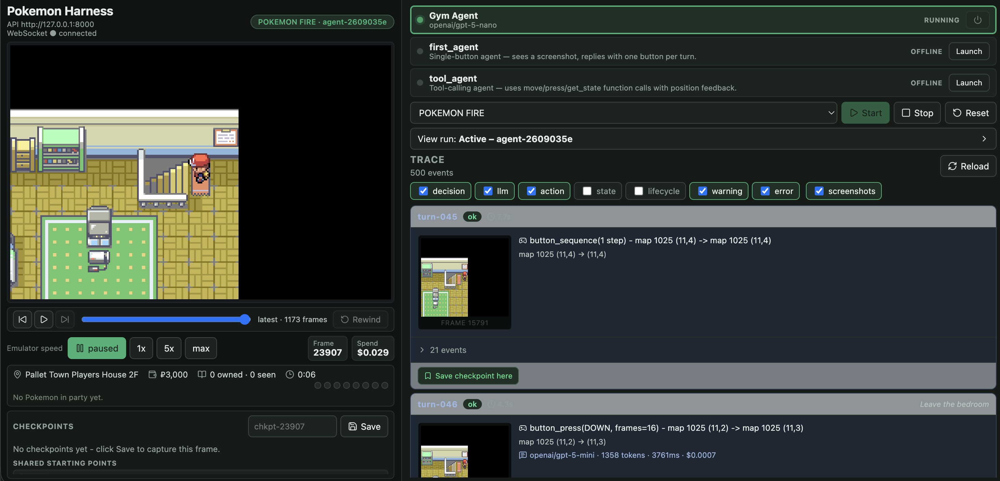

# Pokemon LLM Harness

**Watch an LLM play Pokemon — and see exactly what it saw, what it decided, and why, on every single turn.**

This is a local agent harness for Pokemon Red/Blue and Pokemon Fire Red. Point any LLM at the game and the UI shows you the live screen on the left and a turn-by-turn trace of the agent's mind on the right: the observation it was given, the reasoning it produced, the button it pressed, the raw prompt and token usage, and the screenshot at that moment. Every run is checkpointed and replayable, so you can pause, rewind, branch, and resume from any point.

It's built around two ideas that most "LLM plays a game" demos skip: **observability** (you can always answer *why did it do that?*) and **debuggability** (a run is a first-class artifact you can inspect and replay, not a stream you watch once).


## Why it's interesting

Getting an LLM to *press buttons* in an emulator is easy. Getting one to make real, observable, recoverable progress is a harness-engineering problem, and that's what this project is really about:

- **A meta-harness that supervises the run.** `harness/meta.py` defines the journey (bedroom → Pallet Town → Oak's lab → starter → Route 1 → … → Boulder Badge) as an ordered list of milestones, each checked against game RAM every turn. It auto-checkpoints at every milestone, rolls back on a party wipe or a no-progress stall, escalates to a stronger model when stuck, and enforces a hard dollar budget.
- **RAM-derived observations, not pixels-only.** The agent is told its exact location, party (with moves and PP), live battle HP for both sides, and — crucially — the **exits and map connections mined from the game's own disassembly**. Feeding the agent the real door coordinates cut "leave the bedroom" from 11 turns to 4.
- **A clean split between game state and LLM context.** Game state is the authoritative world record; LLM context is a minimal, cache-stable *projection* of it. History is built from plain-language turn summaries (`"move RIGHT×3 → (x=5,y=6), press A"`), and screenshots never leak into history — so the prefix cache stays warm and tokens stay flat. (See `LESSONS.md`.)
- **Deterministic macros for the parts LLMs fumble.** `battle_move(slot)` and `goto(x,y)` drive the game's menu cursor and pathing from RAM reads, so the model spends its budget on decisions, not on fighting fiddly menus.
- **Checkpoint + rollback that includes the agent's brain.** A checkpoint saves emulator state *and* a sidecar of the agent's own history/notes, so a rewind restores both the world and what the agent "knew" — runs stay consistent across branches.
- **Two emulators, one API.** Pokemon Red/Blue run on PyBoy; Pokemon Fire Red runs on locally built mGBA Python bindings. Dispatch is by ROM suffix; the harness API is identical either way.

If you're learning how to build LLM agent harnesses, this is a compact, real-world example of the hard parts: observability, state management, cost control, and recovery.

## Features

- Live browser UI: gameplay on the left, merged agent + environment traces on the right.
- Launch, select, and stop agents from the UI; pick which game each run uses.
- Game status panel: location, money, badges, pokedex, play time, party cards with HP bars.
- Turn-based trace cards for observations, decisions, actions, LLM calls, screenshots, and raw payloads — expandable from summary down to raw payload.
- Save states and checkpoints (with thumbnails) for pausing, rewinding, and branching runs.
- Replay timeline: scrub or play back every captured frame of a live or past run.
- Mission tracker: the gym agent's 12-milestone journey rendered as a dot tracker with per-milestone cost.
- Human-in-the-loop steering: type an instruction during a live run and the agent folds it into its next turn.
- Benchmark mode and one-file HTML trace export for comparing models and sharing runs.
- Provider-neutral harness API: write an agent in Python, or call the HTTP API from any language.

## Quick start

Requirements: Python 3.12+, [`uv`](https://docs.astral.sh/uv/), Node.js + npm, and RGBDS (to build local Red/Blue-compatible ROMs from source). macOS, Linux, and WSL are supported; native Windows is unverified (use WSL).

```bash
# 1. Install RGBDS (macOS)
brew install rgbds

# 2. One-time setup: installs deps, builds local ROM binaries, creates the bedroom save state
scripts/setup.sh

# 3. Run the stack
scripts/dev.sh
```

Then open `http://localhost:5173`, click **Launch** next to an agent in the Agents panel, pick a game, and click **Start**. Agent stdout/stderr lands in `logs/<agent>.log`.

To add or remove agents, edit `agents.yaml`:

```yaml
agents:
  - name: my_agent
    module: harness.examples.my_agent
    description: One line shown in the UI.
```

## The Gym Agent (mission: Boulder Badge)

`gym_agent` is the strongest bundled harness — its mission is to reach Pewter City and beat Brock. It combines rich RAM observations, deterministic battle/movement macros (including a `take_starter` pickup that drives Oak's-lab prompts from the menu cursor), a structured world map plus learned per-map walls and a persistent notes scratchpad, and the meta-harness supervisor described above.

Model defaults (override with `POKEMON_AGENT_MODEL` / `POKEMON_ESCALATION_MODEL`):

| Role | Model | $/M in / out |
|---|---|---|
| Workhorse | `openai/gpt-5-nano` | 0.05 / 0.40 |
| Escalation (when stuck) | `openai/gpt-5-mini` | 0.25 / 2.00 |
| Cheap alternates | `qwen/qwen3.5-flash-02-23`, `google/gemini-2.5-flash-lite` | ~0.07–0.10 in |

**What it does reliably today:** leaves the bedroom (turn 1–4), exits to Pallet Town, and obtains its starter from Oak's lab (~turn 19, ~$0.005 with gpt-5-nano), with the meta-harness firing milestone checkpoints and recovering from navigation loops via rollback. Clearing all the way to Brock unattended in one run is not yet reliable at this model tier — the harness is built for steady, observable, recoverable progress and easy model swaps, not a guaranteed clear. That gap is the fun part.

## Build your own agent

Subclass `PokemonAgent`, set a name, and implement `run()`:

```python
from harness import PokemonAgent

class FirstAgent(PokemonAgent):
    name = "First Agent"
    model = "qwen/qwen3.6-flash"

    def run(self) -> None:
        while not self.should_stop():
            with self.turn(goal="leave the bedroom"):
                state = self.state()
                self.emit("observation", {"pokemon": state["pokemon"]})
                self.emit("decision", {"action": "RIGHT", "reasoning": "Moving toward the exit."})
                self.press("RIGHT")

if __name__ == "__main__":
    FirstAgent().serve()
```

A fuller working template is in `harness/examples/first_agent.py`. The main helpers inside `run()`:

| Method | Description |
|---|---|
| `screenshot_bytes()` / `screenshot(path)` | Current game screen as PNG bytes / to a file |
| `state()` | Current game state: map, position, party, screen hash |
| `press(button)` | Press A / B / UP / DOWN / LEFT / RIGHT / START / SELECT |
| `sequence(steps)` | Run button/wait steps as one atomic sequence |
| `save_state(name)` / `load_state(name)` | Save / load a run-local or shared checkpoint |
| `emit(type, payload)` | Add a structured event to the trace UI |
| `turn(goal=...)` | Context manager grouping one logical agent step (auto trace correlation) |
| `should_stop()` | Check whether the UI asked the agent to stop |

Override `serialize_history()` / `restore_history(data)` if your agent has message history, memory, or planning state that should rewind with a checkpoint.

## LLM providers

`harness.llm.LLMClient` wraps provider calls with retry/backoff and normalized response/error payloads. The example agents use OpenRouter by default:

```python
from harness.llm import LLMClient, provider_from_env

llm = LLMClient(provider_from_env("openrouter"))
response = llm.chat(messages, model="qwen/qwen3.6-flash")
```

Built-in presets: `openrouter` (`OPENROUTER_API_KEY`, the default path), `openai` (`OPENAI_API_KEY`), `gemini` (`GEMINI_API_KEY`). For another OpenAI-compatible provider, pass your own `LLMProviderConfig`; for a different API shape, implement the small `LLMProvider` protocol.

## Pokemon Fire Red (optional)

Fire Red is a GBA game, so it runs on mGBA instead of PyBoy. One extra setup step builds everything from upstream source — the ROM from `pret/pokefirered` (byte-matches retail) and the mGBA Python bindings:

```bash
brew install cmake libpng pkg-config arm-none-eabi-binutils   # macOS build deps
scripts/setup_firered.sh
```

Afterwards "POKEMON FIRE" appears in the UI's game dropdown, with a `bedroom-pokefirered` start state so agents skip the long intro.

## Benchmark and share runs

Score how far models get on the journey, ranked by milestones reached then cost:

```bash
# Score runs that already happened (no backend needed):
uv run python scripts/bench.py score runs/<run-a> runs/<run-b> -o bench-results.json

# Live head-to-head (with scripts/dev.sh running), capped per model:
uv run python scripts/bench.py run --models openai/gpt-5-nano,google/gemini-2.5-flash-lite \
    --max-turns 120 --budget 0.50
```

Export any run as a single self-contained HTML file — game frames, per-turn reasoning, tool calls, token/cost usage, and milestone/rollback banners — to drop into a blog post or share:

```bash
uv run python scripts/generate_trace_html.py runs/<run-id>   # writes runs/<run-id>/trace.html
```

## Useful commands

```bash
scripts/verify.sh                                      # backend tests + frontend production build
uv run python -m harness.replay runs/<run-id>/env.jsonl  # replay button actions from a recorded trace
```

See `docs/architecture.md` for the repository layout and full API shape, and `LESSONS.md` for the design lessons behind the game-state/LLM-context split.

## Legal boundary

This project does not download or distribute commercial ROM files. The setup script builds local ROM-compatible binaries from `pret/pokered` source for personal development; you are responsible for ensuring your use complies with applicable law. Generated ROMs, save states, traces, and cloned upstream source are local-only and git-ignored.

## License

Released under the [MIT License](LICENSE).
</content>
